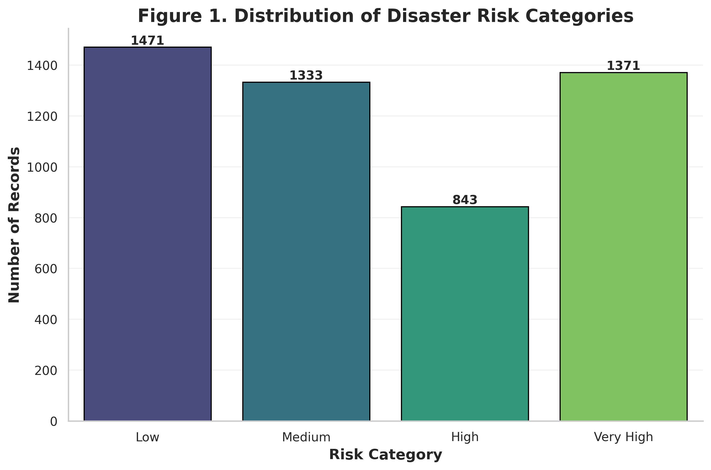
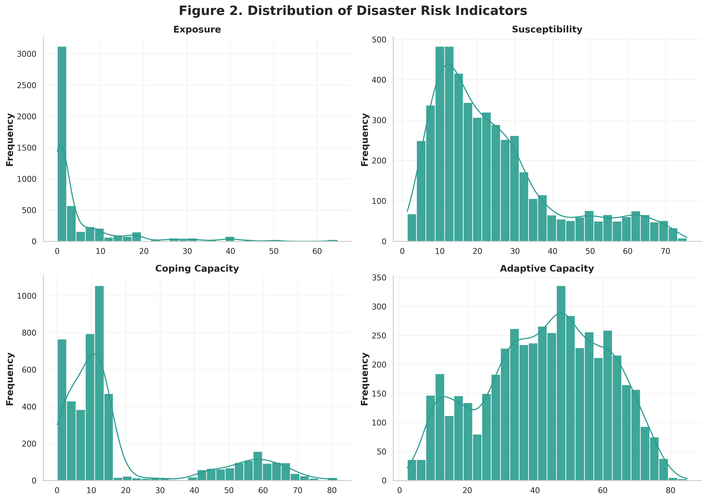
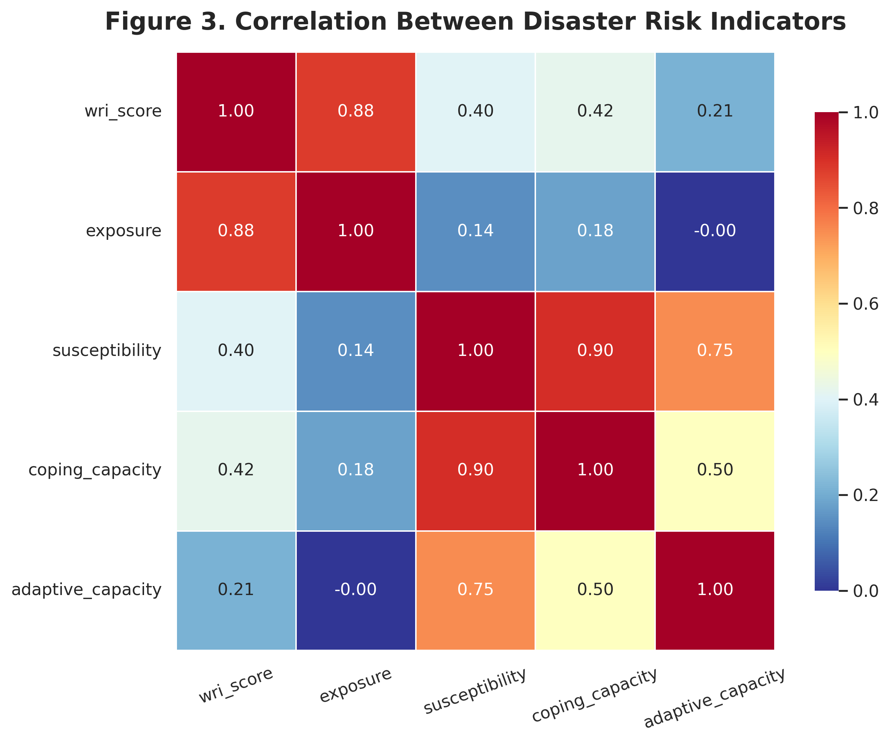
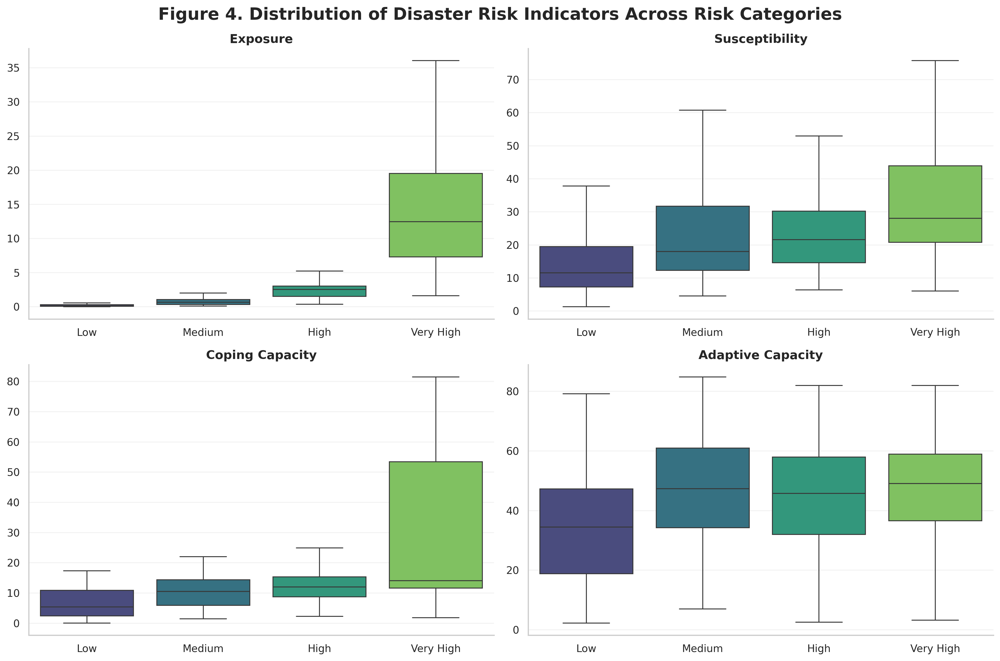
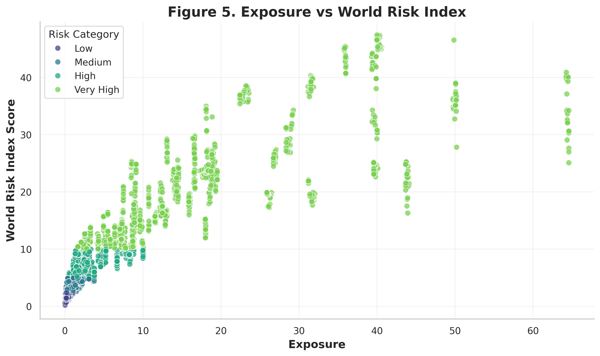
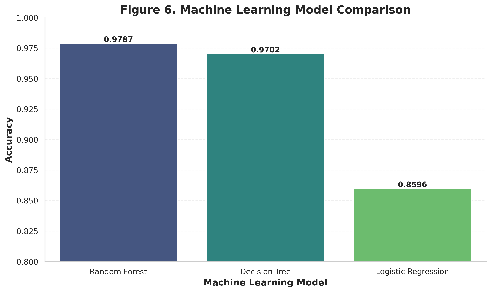
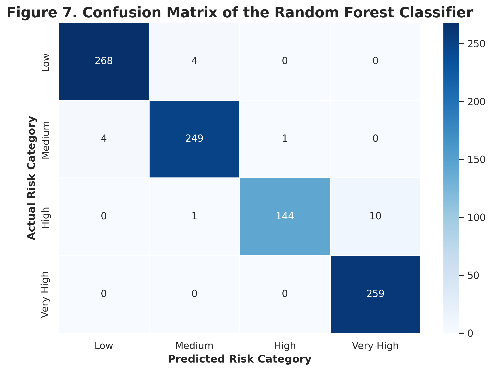
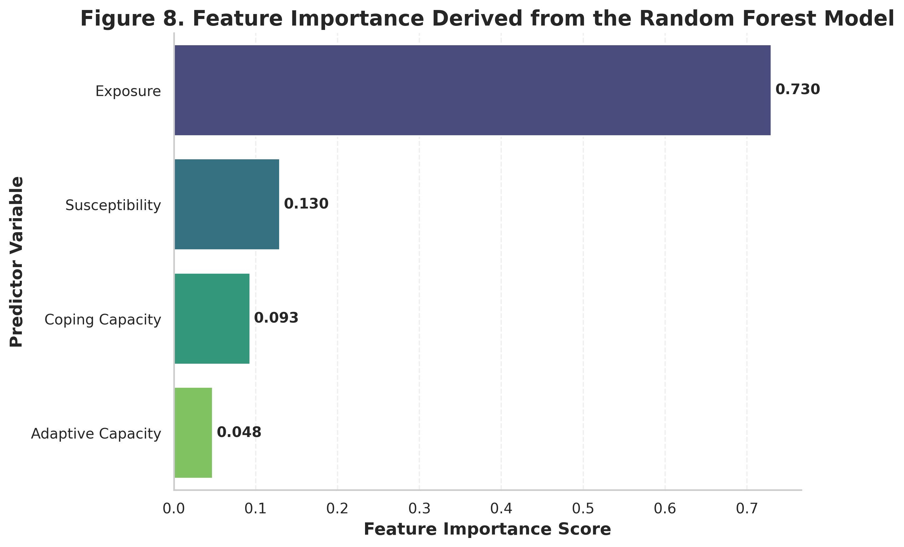

# Disaster Risk Classification Using Apache Spark ML

## Machine Learning-Based Classification of Disaster Risk

This project develops an end-to-end machine learning workflow using **Apache Spark and PySpark ML** to classify disaster risk categories from key disaster risk indicators.

The analysis uses four predictor variables:

- Exposure
- Susceptibility
- Coping Capacity
- Adaptive Capacity

The target variable is the **disaster risk category**, classified into:

- Low
- Medium
- High
- Very High

The project covers data preparation, exploratory data analysis, feature engineering, machine learning model development, model evaluation, feature importance analysis, and interpretation of classification results.

---

## Project Overview

Disaster risk is influenced by multiple interacting dimensions, including exposure to hazards, susceptibility of populations and systems, coping capacity, and adaptive capacity.

This project applies machine learning to these indicators to develop a multiclass classification framework for disaster risk assessment.

### Objectives

1. Explore the distribution and relationships among disaster risk indicators.
2. Prepare the dataset for machine learning using PySpark.
3. Develop multiple classification models.
4. Compare model performance using standard evaluation metrics.
5. Identify the most influential predictors using Random Forest feature importance.
6. Evaluate classification performance using a confusion matrix.

---

## Machine Learning Workflow

```text
Disaster Risk Dataset
        │
        ▼
Data Loading
        │
        ▼
Data Preparation & Validation
        │
        ▼
Exploratory Data Analysis
        │
        ├── Risk Category Distribution
        ├── Feature Distributions
        ├── Correlation Analysis
        ├── Boxplots
        └── Exposure vs WRI Analysis
        │
        ▼
Feature Engineering
        │
        ▼
Machine Learning Dataset
        │
        ▼
Train-Test Split
        │
        ├───────────────┬────────────────┐
        ▼               ▼                ▼
Logistic Regression  Decision Tree   Random Forest
        │               │                │
        └───────────────┴────────────────┘
                        │
                        ▼
                Model Evaluation
                        │
             ┌──────────┴──────────┐
             ▼                     ▼
      Model Comparison      Confusion Matrix
                                   │
                                   ▼
                           Feature Importance
```

---

# Dataset and Features

The analysis uses disaster risk indicators representing different dimensions of disaster risk.

## Predictor Variables

| Feature | Description |
|---|---|
| `exposure` | Indicator representing exposure to disaster-related hazards |
| `susceptibility` | Indicator representing susceptibility to disaster impacts |
| `coping_capacity` | Indicator representing the ability to cope with disaster impacts |
| `adaptive_capacity` | Indicator representing the ability to adapt to changing risk conditions |

## Additional Variable

| Variable | Description |
|---|---|
| `wri_score` | World Risk Index score used for exploratory analysis and relationship assessment |

## Target Variable

The machine learning target variable is:

`risk_category`

The target contains four disaster risk classes:

- Low
- Medium
- High
- Very High

---

# Exploratory Data Analysis

## 1. Risk Category Distribution

The distribution of observations across the four disaster risk categories was examined to understand the composition of the classification dataset.



---

## 2. Distribution of Disaster Risk Indicators

The distributions of Exposure, Susceptibility, Coping Capacity, and Adaptive Capacity were examined before machine learning model development.



The indicators show different distribution patterns and ranges, providing useful information for feature engineering and classification.

---

## 3. Correlation Analysis

Correlation analysis was performed to examine relationships among the World Risk Index and the selected disaster risk indicators.



Important observed relationships include:

| Variable Pair | Correlation |
|---|---:|
| WRI Score – Exposure | 0.88 |
| Susceptibility – Coping Capacity | 0.90 |
| Susceptibility – Adaptive Capacity | 0.75 |
| Coping Capacity – Adaptive Capacity | 0.50 |
| WRI Score – Coping Capacity | 0.42 |
| WRI Score – Susceptibility | 0.40 |
| WRI Score – Adaptive Capacity | 0.21 |

The analysis shows a strong positive relationship between **WRI Score and Exposure**, with a correlation of approximately **0.88**.

---

## 4. Distribution Across Risk Categories

Boxplots were used to examine how the disaster risk indicators vary across Low, Medium, High, and Very High risk categories.



The distributions demonstrate differences in several predictor variables across the risk categories, indicating that the selected indicators contain useful information for classification.

---

## 5. Exposure vs World Risk Index

The relationship between Exposure and WRI Score was examined using a scatter plot grouped by risk category.



The visualization shows a strong positive relationship between Exposure and WRI Score, with higher-risk observations generally occurring at higher exposure levels.

---

# Machine Learning Models

Three classification algorithms were developed using **Apache Spark and PySpark ML**.

## Logistic Regression

Logistic Regression was used as a baseline multiclass classification model.

## Decision Tree

Decision Tree was used to capture nonlinear relationships between the predictor variables and disaster risk categories.

## Random Forest

Random Forest was implemented as an ensemble classification model using multiple decision trees.

Random Forest was also used for feature importance analysis to understand the relative contribution of the predictor variables.

---

# Model Performance

The three machine learning models were compared using test-set accuracy.



| Model | Accuracy |
|---|---:|
| **Random Forest** | **97.87%** |
| Decision Tree | **97.02%** |
| Logistic Regression | **85.96%** |

## Best Performing Model

**Random Forest achieved the highest test-set accuracy of 97.87%.**

Compared with the other evaluated models:

- Random Forest outperformed Decision Tree by approximately **0.85 percentage points**.
- Random Forest outperformed Logistic Regression by approximately **11.91 percentage points**.

This indicates that Random Forest provided the strongest classification performance among the evaluated models.

---

# Random Forest Performance

The Random Forest model achieved the following test-set performance:

| Evaluation Metric | Score |
|---|---:|
| **Accuracy** | **97.87%** |
| **Weighted Precision** | **97.90%** |
| **Weighted Recall** | **97.87%** |
| **Weighted F1 Score** | **97.86%** |

The close agreement between the weighted Precision, Recall, and F1 Score indicates strong overall classification performance.

---

# Random Forest Confusion Matrix

The confusion matrix provides a detailed view of Random Forest predictions across the four disaster risk categories.



The matrix shows strong diagonal values, indicating that most observations were correctly classified.

## Correct Classifications

| Actual Risk Category | Correct Predictions |
|---|---:|
| Low | 268 |
| Medium | 249 |
| High | 144 |
| Very High | 259 |

Most classification errors occurred between neighboring risk categories, particularly between **High and Very High**.

---

# Random Forest Feature Importance

Feature importance was extracted from the trained Random Forest model to identify the relative contribution of each predictor variable.



| Predictor Variable | Importance |
|---|---:|
| **Exposure** | **0.730** |
| Susceptibility | 0.130 |
| Coping Capacity | 0.093 |
| Adaptive Capacity | 0.048 |

## Key Finding

**Exposure was the dominant predictor**, with a Random Forest feature importance score of approximately **0.730**.

This was substantially higher than the importance of:

- Susceptibility — 0.130
- Coping Capacity — 0.093
- Adaptive Capacity — 0.048

> **Note:** Feature importance represents the contribution of variables within the trained Random Forest model. It should not be interpreted as causal influence.

---

# Key Findings

### 1. Random Forest achieved the best performance

Random Forest achieved the highest test-set accuracy:

**97.87%**

followed by:

- Decision Tree — **97.02%**
- Logistic Regression — **85.96%**

### 2. Random Forest demonstrated strong classification performance

The model achieved:

- Accuracy: **97.87%**
- Weighted Precision: **97.90%**
- Weighted Recall: **97.87%**
- Weighted F1 Score: **97.86%**

### 3. Exposure was the most influential predictor

Exposure had a feature importance score of **0.730**, substantially higher than the other predictors.

### 4. Exposure showed a strong relationship with WRI Score

The correlation between WRI Score and Exposure was approximately **0.88**.

### 5. The four risk categories were effectively classified

The Random Forest confusion matrix shows strong classification performance across Low, Medium, High, and Very High risk categories.

---

# Technologies Used

### Programming

- Python

### Big Data Processing

- Apache Spark
- PySpark

### Machine Learning

- PySpark ML

### Data Processing

- Pandas
- NumPy

### Visualization

- Matplotlib
- Seaborn
- Plotly

### Development Environment

- Google Colab

### Version Control

- GitHub

---

# Repository Structure

```text
Disaster-Risk-Classification-Using-Apache-Spark-ML/
│
├── data/
│
├── images/
│   ├── fig01_risk_category_distribution.png
│   ├── fig02_feature_distribution.png
│   ├── fig03_correlation_heatmap.png
│   ├── fig04_boxplots.png
│   ├── fig05_exposure_vs_wri.png
│   ├── fig06_model_comparison.png
│   ├── fig07_confusion_matrix.png
│   └── fig08_feature_importance.png
│
├── notebooks/
│   └── Disaster_Risk_Classification.ipynb
│
├── requirements.txt
├── .gitignore
└── README.md
```

---

# How to Run the Project

## Google Colab

The recommended environment for reproducing the analysis is Google Colab.

Open the notebook:

`notebooks/Disaster_Risk_Classification.ipynb`

The notebook can be executed directly in Google Colab.

Run the notebook sequentially from the beginning to reproduce the analysis.

## Local Environment

Clone the repository:

```bash
git clone https://github.com/<your-username>/Disaster-Risk-Classification-Using-Apache-Spark-ML.git
```

Move into the project directory:

```bash
cd Disaster-Risk-Classification-Using-Apache-Spark-ML
```

Install the required dependencies:

```bash
pip install -r requirements.txt
```

Then open:

`notebooks/Disaster_Risk_Classification.ipynb`

---

# Reproducibility

The complete machine learning workflow is contained in the project notebook.

The notebook covers:

- Data loading
- Data preparation
- Data quality validation
- Exploratory data analysis
- Feature engineering
- Machine learning dataset preparation
- Train-test splitting
- Model training
- Model evaluation
- Model comparison
- Feature importance
- Confusion matrix analysis

The project was developed using **Google Colab, Apache Spark, and PySpark ML**.

---

# Limitations

The results should be interpreted within the scope of the available dataset, selected predictors, and test-set evaluation.

- The model uses four primary predictor variables.
- Additional socioeconomic, environmental, demographic, and institutional factors could potentially improve classification.
- Model performance depends on the distribution and quality of the available observations.
- Feature importance represents model contribution and should not be interpreted as causal influence.
- Independent external validation would provide stronger evidence of model generalizability.
- Further hyperparameter tuning and cross-validation could be used to optimize model performance.

---

# Future Scope

Potential extensions include:

- Hyperparameter tuning using Spark ML
- Cross-validation and model optimization
- Class-specific Precision, Recall, and F1 analysis
- Additional socioeconomic and environmental predictors
- Temporal disaster risk classification
- Spatial visualization of predicted risk categories
- Integration with GIS-based disaster risk assessment workflows
- Independent external validation
- Deployment of the trained model for automated disaster risk classification

---

# Conclusion

This project demonstrates an end-to-end **Apache Spark machine learning workflow for multiclass disaster risk classification**.

Three classification algorithms were evaluated:

- Logistic Regression
- Decision Tree
- Random Forest

Among the evaluated models, **Random Forest achieved the highest test-set accuracy of 97.87%**, with:

- **97.90% weighted Precision**
- **97.87% weighted Recall**
- **97.86% weighted F1 Score**

Feature importance analysis identified **Exposure as the dominant predictor**, with an importance score of approximately **0.730**.

The exploratory analysis also identified a strong relationship between **Exposure and WRI Score**, with a correlation of approximately **0.88**.

Overall, the results demonstrate the potential of **PySpark ML and ensemble learning techniques** for developing high-performing classification workflows for disaster risk analysis.

---

# Author

## Vyshnav P S

**Disaster Risk Management | GIS & Spatial Analysis | Data Analytics | Machine Learning**

This project demonstrates the application of **Apache Spark, PySpark ML, data analysis, and machine learning to disaster risk classification**.

---

**Project Focus:** Disaster Risk Classification • Apache Spark • PySpark ML • Random Forest • Machine Learning • Risk Analytics • GIS • Disaster Management
